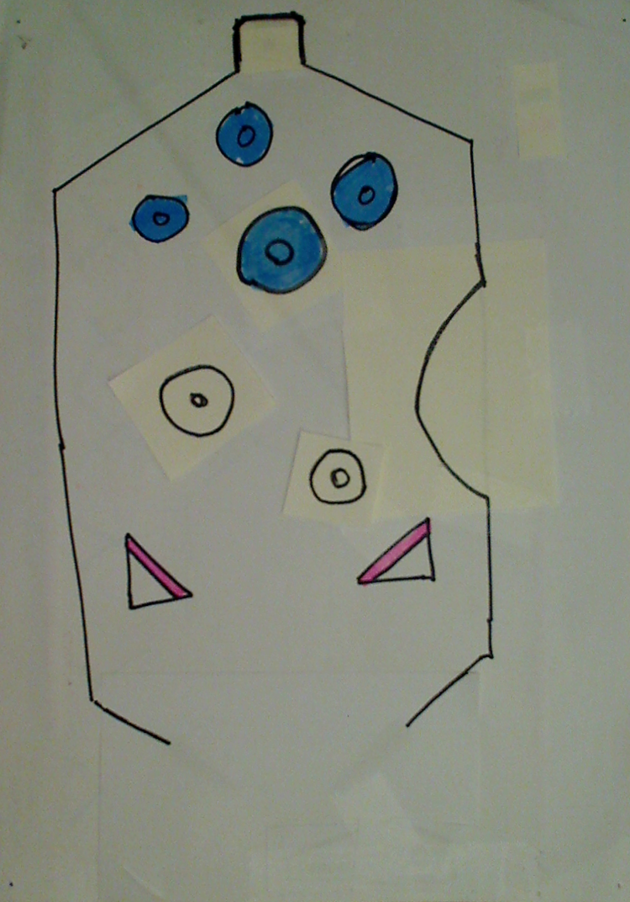

# DrawYourOwnPinball

Draw your own pinball field and play it!

**Rules:**

- The ball is lost when it goes off screen.
- You have 999 lives.
- You can place the ball anywhere on the playing field.
- The flippers are controlled by the left and right mouse button.
- Follow the instruction in the console.
- Any bugs are features. 
- Press escape to exit at any points. Do not pass Go. Do not collect $200.

This was made for a course using OpenCV. The task was **"Make a pinball game playable by hands or keyboard."**. I took the liberty of also allowing a mouse as input.

**Warning**: This is not good code. It was supposed to to take ~4 hours, it took ~4 (sick) days.

## Demo

A demo field is available: 



A video:

 

## Usage

Connect a webcam or have a picture/scan of a playing field ready.

`python -m pinball`

`python -m pinball -f <file>` (if you want to use a pre-captured image.)

_Notice: This is written in Python 3. If your distribution still defaults to Python 2, complain to the developers and use `python3`._

## Licence

Copyright © 2019 - Dries Kennes

Before the 1st of february 2019: _All right reserved._

After the 1st of february 2019: _Do What The Fuck You Want To Public License_ (WTFPL)

```
        DO WHAT THE FUCK YOU WANT TO PUBLIC LICENSE 
                    Version 2, December 2004 

 Copyright (C) 2004 Sam Hocevar <sam@hocevar.net> 

 Everyone is permitted to copy and distribute verbatim or modified 
 copies of this license document, and changing it is allowed as long 
 as the name is changed. 

            DO WHAT THE FUCK YOU WANT TO PUBLIC LICENSE 
   TERMS AND CONDITIONS FOR COPYING, DISTRIBUTION AND MODIFICATION 

  0. You just DO WHAT THE FUCK YOU WANT TO.
```
